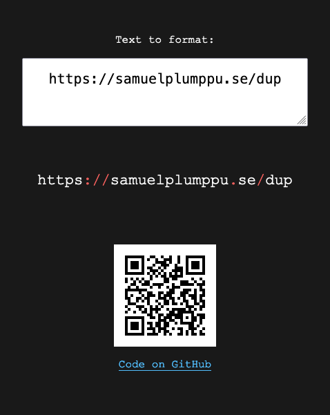

# dup

> Easily and securely copy sensitive URLs, texts, codes and passwords across devices.

🍃 Try the app at https://samuelplumppu.se/dup 🍃

## Features

-   Generates a QR Code based on the text input that can be scanned and used on another device. Ideally, use a privacy friendly QR scanner app (with history turned off).
-   Color highlighting for special characters and numbers to make it as easy as possible if you need to manually type the text into another device.
-   All sensitive data is cleared when the app is closed, and the app only runs on your device.

## License

GPL-3.0
